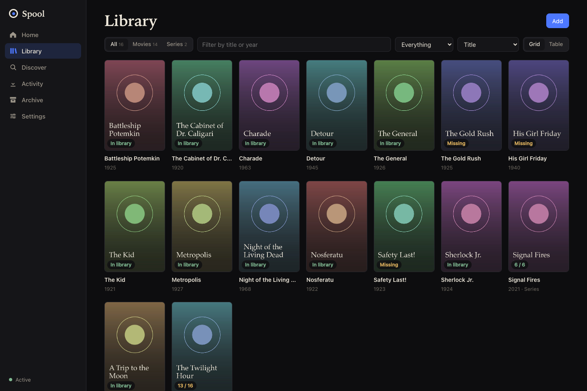
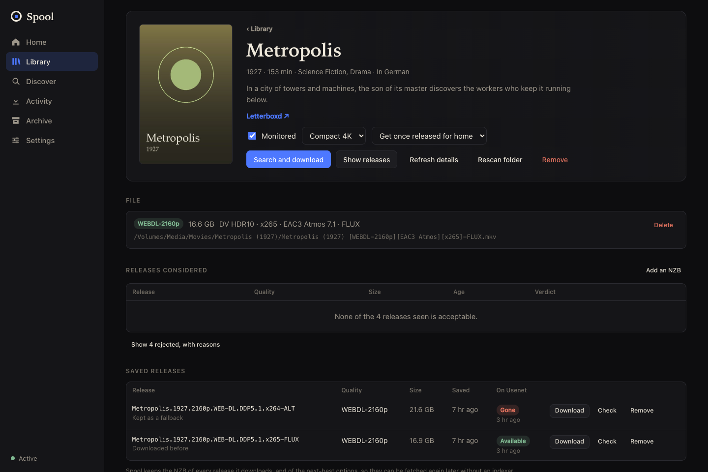
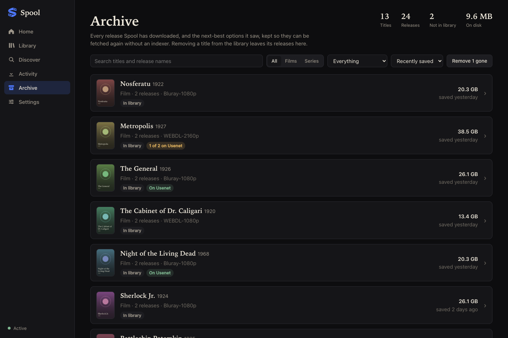

<p align="center"></p>
<h1 align="center">Spool</h1>
<p align="center">One service that finds, downloads, verifies and files movies and television.<br>It does the work of Radarr, Sonarr and SABnzbd in a single process with a single queue and a single web app.</p>



## What it does

- **One catalog for movies and series**, with quality profiles, a size target per profile, upgrades, and a recorded reason for every release it accepts or rejects.
- **A built-in Usenet downloader.** NNTP over TLS across several providers, resumable, with PAR2 repair and extraction. Posts packed as uncompressed RAR volumes are unpacked while they download, so they need about half the disk space and no extraction step.
- **Checks before it commits.** A release is sampled on your Usenet servers before downloading; dead posts are skipped. Downloads the disk cannot hold wait instead of starting.
- **An archive of every NZB it fetches**, so something deleted to make room can be downloaded again later, and a search still has something to offer when an indexer is down.
- **Plex aware.** Matches titles to Plex items, links to them, asks Plex to rescan after imports, and knows what has been watched.
- **Disk space as a first-class concern.** Shows what is using space, what has been watched and what could be fetched again, and can replace an oversized file with a smaller copy.
- **An MCP endpoint**, so an AI assistant can look things up, explain why a title has not downloaded, and operate Spool.
- **Careful with your library.** Starts in a mode that changes nothing, journals every import, keeps replaced files in a recycle folder, and refuses to write when the media volume is not mounted.

<p>


</p>

## Status

Spool runs one household's library day to day. It is young, and it is built for a single trusted user on a private network. It runs on macOS and Linux, natively or in a container; the test suite runs on both. It supports Usenet only (no torrents), Newznab indexers, TMDB for movies and TVmaze for series.

## Getting started

### With Docker

```sh
git clone https://github.com/rewtraw/spool && cd spool
mkdir -p data                      # owned by the user in compose.yaml
$EDITOR compose.yaml               # set the user and the path to your media
docker compose up -d --build       # http://localhost:7979
```

The image carries the helper tools Spool calls. Everything Spool keeps lives in `/data`. Mount the library and the downloads folder under one path, so a finished download is moved into the library instead of copied.

On **TrueNAS SCALE**, add it as a custom app with the same settings as [compose.yaml](compose.yaml): port 7979, a dataset for `/data`, your media dataset at `/media`, and the apps user (568) as the user.

### From source

You need Rust, [Bun](https://bun.sh), and the helper tools Spool calls: `par2` for repair, `7zz` for extraction and `ffprobe` for reading media files.

```sh
brew install par2 sevenzip ffmpeg                # macOS
sudo apt install par2 7zip ffmpeg                # Debian, Ubuntu

git clone https://github.com/rewtraw/spool && cd spool
(cd web && bun install && bun run build)         # the server embeds web/dist
cargo run --release -p spool -- serve            # http://localhost:7979
```

Debian's and Ubuntu's `7zip` cannot open RAR archives. Spool unpacks the common uncompressed kind itself, so most posts are unaffected; for the rest, install 7-Zip from [its own releases](https://github.com/ip7z/7zip/releases), as the container image does.

Then, in Settings:

1. **General**: where movies and series live, where to download to, and a free [TMDB API key](https://www.themoviedb.org/settings/api) for movie lookups. Set a password if anyone else can reach the address.
2. **Usenet**: one or more providers.
3. **Indexers**: one or more Newznab indexers.

Spool starts in **shadow mode**: it reads the indexer feeds and records what it would download, and changes nothing. Switch to active in Settings, or with `spool mode active`, once nothing else manages the same folders.

### Coming from Radarr, Sonarr and SABnzbd

`spool migrate` reads their databases and settings and brings over the catalog, profiles, indexers and Usenet servers. `spool check-paths` then reports whether every existing file is where Spool's naming would put it, and `spool shadow-report` compares how Spool reads past releases with how they were read before. Nothing on disk is moved.

## Command line

```sh
spool serve [--bind 0.0.0.0:7979]   # run the service
spool mode active|shadow            # start or stop making changes
spool migrate ...                   # import from Radarr, Sonarr and SABnzbd
spool check-paths                   # are existing files where Spool would put them?
spool download x.nzb --out DIR      # run one NZB through the engine, outside the library
spool backup DEST                   # write a consistent copy of the database
```

Data lives in `~/Library/Application Support/Spool` on macOS, `~/.local/share/spool` on Linux and `/data` in the container; `--data-dir` or `SPOOL_DATA_DIR` puts it elsewhere. The database holds indexer keys and Usenet passwords and is created readable only by its owner.

## Using it from an AI assistant

Spool serves the [Model Context Protocol](https://modelcontextprotocol.io) at `/mcp`. It always requires a key, which Spool generates on first start; Settings → General → AI access copies the command to add it to Claude Code, and can create a second key limited to read-only tools.

```sh
claude mcp add --transport http --scope user spool http://localhost:7979/mcp --header "Authorization: Bearer <key>"
```

Tools cover status, finding and adding titles, searching and choosing releases, managing downloads, the archive, disk space, Plex, logs, and a `diagnose` tool that answers "why has this not downloaded" in one call. Anything that deletes files needs an explicit confirmation.

## Running it as a service

**Linux.** [deploy/spool.service](deploy/spool.service) is a systemd user unit; the steps to install it are at the top of the file.

**macOS.** `deploy/deploy.sh` builds Spool, installs it as a LaunchAgent on a Mac over SSH and restarts it. It reads its settings from the environment or from `deploy/local.env`:

```sh
SPOOL_HOST=my-mac deploy/deploy.sh
```

If the library is on a removable disk, set `SPOOL_SIGN_IDENTITY` to a stable code-signing identity. macOS ties the permission to read a removable disk to the program's signature, and the first read under launchd shows a consent prompt on that Mac's screen. Spool reports that it is waiting for the prompt instead of hanging.

## Development

```sh
cargo test --workspace     # needs ffmpeg, par2 and 7zz for the full suite
(cd web && bun run check)
```

| Path | What it is |
| --- | --- |
| `crates/spool-core` | Release parsing, quality model, profiles, decisions, naming. No I/O. |
| `crates/spool-nntp` | The Usenet engine. |
| `crates/spool` | The server: catalog, indexers, search and grab, import journal, scheduler, API, MCP, CLI. |
| `web` | The Svelte web app. |
| `tools` | Scripts that generate the ported pattern table and extract upstream test cases. |
| `deploy` | Service files and the macOS install script. |
| `Dockerfile`, `compose.yaml` | The container image and an example of running it. |

The tests run the real application against a fake indexer and a fake Usenet server, end to end. [docs/architecture.md](docs/architecture.md) describes how the pieces fit.

## Credits and license

Spool is licensed under the [GNU General Public License v3](LICENSE).

Its release-name parsers are ported from [Radarr](https://github.com/Radarr/Radarr) and [Sonarr](https://github.com/Sonarr/Sonarr), and their parser test cases run as Spool's fixtures. Movie details and artwork come from [TMDB](https://www.themoviedb.org); this product uses the TMDB API but is not endorsed or certified by TMDB. Series details come from [TVmaze](https://www.tvmaze.com).

Spool is a tool for managing a media library. You are responsible for what you use it to download and for complying with the terms of the services you connect it to.
